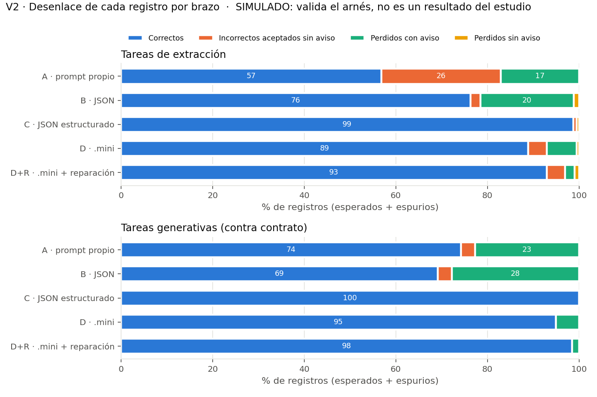
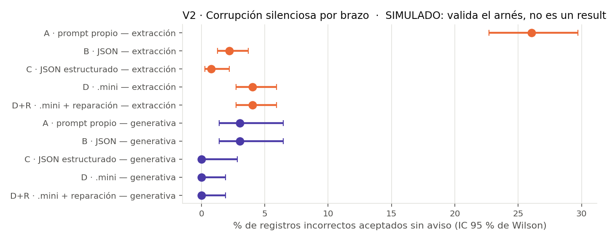
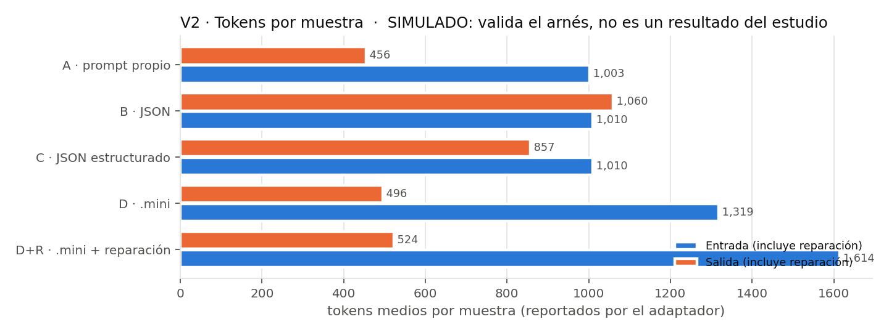
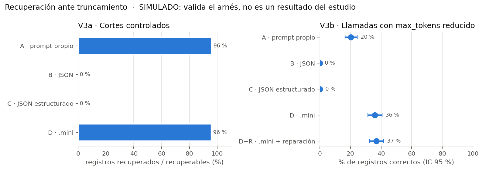

# Resumen del experimento generativo — piloto

> **RESULTADOS SIMULADOS.** Estas cifras provienen del adaptador simulado, cuyas tasas de falla son supuestos del simulador. Solo validan que el arnés funciona de extremo a extremo; **no son resultados del estudio** y no deben citarse como evidencia sobre ningún formato ni modelo.

Muestras: 504 · commit: `0cfa477e30` · adaptador: simulado

Proporciones de registros sobre (esperados + espurios); IC 95 % de Wilson (por registro: optimistas, ver docstring de analyze.py).

## Por brazo

| exp. | tipo | brazo | muestras | parseable % [IC95] | exacto % [IC95] | reg. correctos % | incorrectos sin aviso % | perdidos sin aviso % | perdidos con aviso % | tok. entrada | tok. salida | latencia ms | llamadas rep. |
|---|---|---|---|---|---|---|---|---|---|---|---|---|---|
| v2 | extraccion | A | 54 | 100.0 [93.4–100.0] | 0.0 [0.0–6.6] | 56.8 [52.8–60.7] | 26.1 [22.7–29.7] | 0.0 [0.0–0.6] | 17.1 [14.3–20.4] | 1228.0 | 449.3 | 5217.8 | 0 |
| v2 | extraccion | B | 54 | 79.6 [67.1–88.2] | 50.0 [37.1–62.9] | 76.3 [72.7–79.5] | 2.2 [1.3–3.7] | 1.2 [0.6–2.4] | 20.4 [17.3–23.8] | 1238.7 | 1059.9 | 11929.8 | 0 |
| v2 | extraccion | C | 36 | 100.0 [90.4–100.0] | 86.1 [71.3–93.9] | 98.7 [97.1–99.5] | 0.8 [0.3–2.2] | 0.5 [0.1–1.8] | 0.0 [0.0–1.0] | 1238.7 | 849.8 | 9622.9 | 0 |
| v2 | extraccion | D | 54 | 100.0 [93.4–100.0] | 46.3 [33.7–59.4] | 88.9 [86.1–91.2] | 4.0 [2.7–5.9] | 0.5 [0.2–1.5] | 6.6 [4.8–8.8] | 1543.0 | 481.9 | 5579.2 | 0 |
| v2 | extraccion | D+R | 54 | 100.0 [93.4–100.0] | 57.4 [44.2–69.7] | 92.9 [90.6–94.7] | 4.0 [2.7–5.9] | 1.0 [0.5–2.2] | 2.0 [1.2–3.5] | 1837.5 | 509.0 | 5980.7 | 22 |
| v2 | generativa | A | 18 | 100.0 [82.4–100.0] | 0.0 [0.0–17.6] | 74.2 [67.7–79.8] | 3.0 [1.4–6.5] | 0.0 [0.0–1.9] | 22.7 [17.4–29.1] | 327.0 | 474.2 | 5476.2 | 0 |
| v2 | generativa | B | 18 | 72.2 [49.1–87.5] | 38.9 [20.3–61.4] | 69.2 [62.5–75.2] | 3.0 [1.4–6.5] | 0.0 [0.0–1.9] | 27.8 [22.0–34.4] | 324.0 | 1058.4 | 11899.3 | 0 |
| v2 | generativa | C | 12 | 100.0 [75.8–100.0] | 100.0 [75.8–100.0] | 100.0 [97.2–100.0] | 0.0 [0.0–2.8] | 0.0 [0.0–2.8] | 0.0 [0.0–2.8] | 324.0 | 878.9 | 9930.7 | 0 |
| v2 | generativa | D | 18 | 100.0 [82.4–100.0] | 66.7 [43.8–83.7] | 95.0 [91.0–97.2] | 0.0 [0.0–1.9] | 0.0 [0.0–1.9] | 5.0 [2.8–9.1] | 646.0 | 538.1 | 6163.8 | 0 |
| v2 | generativa | D+R | 18 | 100.0 [82.4–100.0] | 83.3 [60.8–94.2] | 98.5 [95.6–99.5] | 0.0 [0.0–1.9] | 0.0 [0.0–1.9] | 1.5 [0.5–4.4] | 942.1 | 567.8 | 6584.5 | 7 |
| v3b | extraccion | A | 27 | 100.0 [87.5–100.0] | 0.0 [0.0–12.5] | 17.4 [13.6–22.2] | 13.4 [10.0–17.8] | 0.0 [0.0–1.3] | 69.1 [63.7–74.1] | 1228.0 | 230.0 | 2791.8 | 0 |
| v3b | extraccion | B | 27 | 0.0 [0.0–12.5] | 0.0 [0.0–12.5] | 0.0 [0.0–1.3] | 0.0 [0.0–1.3] | 0.0 [0.0–1.3] | 100.0 [98.7–100.0] | 1238.7 | 535.3 | 6155.2 | 0 |
| v3b | extraccion | C | 18 | 0.0 [0.0–17.6] | 0.0 [0.0–17.6] | 0.0 [0.0–1.9] | 0.0 [0.0–1.9] | 0.0 [0.0–1.9] | 100.0 [98.1–100.0] | 1238.7 | 427.0 | 4959.0 | 0 |
| v3b | extraccion | D | 27 | 100.0 [87.5–100.0] | 0.0 [0.0–12.5] | 37.0 [31.7–42.7] | 0.3 [0.1–1.9] | 0.0 [0.0–1.3] | 62.6 [57.0–67.9] | 1543.0 | 242.6 | 2940.2 | 0 |
| v3b | extraccion | D+R | 27 | 100.0 [87.5–100.0] | 0.0 [0.0–12.5] | 37.7 [32.4–43.4] | 0.3 [0.1–1.9] | 0.0 [0.0–1.3] | 62.0 [56.3–67.3] | 2098.6 | 282.0 | 3577.1 | 22 |
| v3b | generativa | A | 9 | 100.0 [70.1–100.0] | 0.0 [0.0–29.9] | 28.3 [20.4–37.8] | 0.0 [0.0–3.7] | 0.0 [0.0–3.7] | 71.7 [62.2–79.7] | 327.0 | 252.0 | 3036.5 | 0 |
| v3b | generativa | B | 9 | 0.0 [0.0–29.9] | 0.0 [0.0–29.9] | 0.0 [0.0–3.7] | 0.0 [0.0–3.7] | 0.0 [0.0–3.7] | 100.0 [96.3–100.0] | 324.0 | 534.0 | 6134.7 | 0 |
| v3b | generativa | C | 6 | 0.0 [0.0–39.0] | 0.0 [0.0–39.0] | 0.0 [0.0–5.5] | 0.0 [0.0–5.5] | 0.0 [0.0–5.5] | 100.0 [94.5–100.0] | 324.0 | 439.0 | 5068.2 | 0 |
| v3b | generativa | D | 9 | 100.0 [70.1–100.0] | 0.0 [0.0–29.9] | 32.3 [23.9–42.0] | 0.0 [0.0–3.7] | 0.0 [0.0–3.7] | 67.7 [58.0–76.1] | 646.0 | 268.0 | 3192.1 | 0 |
| v3b | generativa | D+R | 9 | 100.0 [70.1–100.0] | 0.0 [0.0–29.9] | 34.3 [25.7–44.1] | 0.0 [0.0–3.7] | 0.0 [0.0–3.7] | 65.7 [55.9–74.3] | 1380.4 | 341.7 | 4242.6 | 9 |

## Por brazo y modelo

| exp. | tipo | brazo | modelo | muestras | parseable % [IC95] | exacto % [IC95] | reg. correctos % | incorrectos sin aviso % | perdidos sin aviso % | perdidos con aviso % | tok. entrada | tok. salida | latencia ms | llamadas rep. |
|---|---|---|---|---|---|---|---|---|---|---|---|---|---|---|
| v2 | extraccion | A | anthropic:claude-haiku-4-5 | 18 | 100.0 [82.4–100.0] | 0.0 [0.0–17.6] | 59.6 [52.6–66.2] | 25.2 [19.7–31.7] | 0.0 [0.0–1.9] | 15.2 [10.8–20.8] | 1228.0 | 456.8 | 5302.1 | 0 |
| v2 | extraccion | A | groq:llama-3.3-70b-versatile | 18 | 100.0 [82.4–100.0] | 0.0 [0.0–17.6] | 51.3 [44.4–58.1] | 25.6 [20.1–32.1] | 0.0 [0.0–1.9] | 23.1 [17.8–29.4] | 1228.0 | 432.3 | 5022.8 | 0 |
| v2 | extraccion | A | openai:gpt-4.1-mini | 18 | 100.0 [82.4–100.0] | 0.0 [0.0–17.6] | 59.6 [52.6–66.2] | 27.3 [21.6–33.9] | 0.0 [0.0–1.9] | 13.1 [9.1–18.5] | 1228.0 | 458.9 | 5328.4 | 0 |
| v2 | extraccion | B | anthropic:claude-haiku-4-5 | 18 | 94.4 [74.2–99.0] | 83.3 [60.8–94.2] | 93.4 [89.1–96.1] | 0.5 [0.1–2.8] | 0.5 [0.1–2.8] | 5.6 [3.1–9.7] | 1238.7 | 1066.1 | 12009.4 | 0 |
| v2 | extraccion | B | groq:llama-3.3-70b-versatile | 18 | 61.1 [38.6–79.7] | 16.7 [5.8–39.2] | 56.1 [49.1–62.8] | 2.5 [1.1–5.8] | 2.5 [1.1–5.8] | 38.9 [32.4–45.8] | 1238.7 | 1046.7 | 11773.1 | 0 |
| v2 | extraccion | B | openai:gpt-4.1-mini | 18 | 83.3 [60.8–94.2] | 50.0 [29.0–71.0] | 79.3 [73.1–84.3] | 3.5 [1.7–7.1] | 0.5 [0.1–2.8] | 16.7 [12.1–22.5] | 1238.7 | 1066.8 | 12006.9 | 0 |
| v2 | extraccion | C | anthropic:claude-haiku-4-5 | 18 | 100.0 [82.4–100.0] | 94.4 [74.2–99.0] | 99.5 [97.2–99.9] | 0.5 [0.1–2.8] | 0.0 [0.0–1.9] | 0.0 [0.0–1.9] | 1238.7 | 854.2 | 9673.2 | 0 |
| v2 | extraccion | C | openai:gpt-4.1-mini | 18 | 100.0 [82.4–100.0] | 77.8 [54.8–91.0] | 98.0 [94.9–99.2] | 1.0 [0.3–3.6] | 1.0 [0.3–3.6] | 0.0 [0.0–1.9] | 1238.7 | 845.4 | 9572.5 | 0 |
| v2 | extraccion | D | anthropic:claude-haiku-4-5 | 18 | 100.0 [82.4–100.0] | 77.8 [54.8–91.0] | 97.5 [94.2–98.9] | 0.0 [0.0–1.9] | 0.0 [0.0–1.9] | 2.5 [1.1–5.8] | 1543.0 | 490.3 | 5673.5 | 0 |
| v2 | extraccion | D | groq:llama-3.3-70b-versatile | 18 | 100.0 [82.4–100.0] | 16.7 [5.8–39.2] | 79.8 [73.7–84.8] | 5.6 [3.1–9.7] | 1.0 [0.3–3.6] | 13.6 [9.5–19.1] | 1543.0 | 465.6 | 5397.0 | 0 |
| v2 | extraccion | D | openai:gpt-4.1-mini | 18 | 100.0 [82.4–100.0] | 44.4 [24.6–66.3] | 89.4 [84.3–93.0] | 6.6 [3.9–10.9] | 0.5 [0.1–2.8] | 3.5 [1.7–7.1] | 1543.0 | 489.8 | 5667.0 | 0 |
| v2 | extraccion | D+R | anthropic:claude-haiku-4-5 | 18 | 100.0 [82.4–100.0] | 94.4 [74.2–99.0] | 99.5 [97.2–99.9] | 0.0 [0.0–1.9] | 0.5 [0.1–2.8] | 0.0 [0.0–1.9] | 1703.3 | 502.2 | 5857.7 | 4 |
| v2 | extraccion | D+R | groq:llama-3.3-70b-versatile | 18 | 100.0 [82.4–100.0] | 33.3 [16.3–56.2] | 86.9 [81.5–90.9] | 5.6 [3.1–9.7] | 2.0 [0.8–5.1] | 5.6 [3.1–9.7] | 2024.4 | 513.9 | 6100.2 | 12 |
| v2 | extraccion | D+R | openai:gpt-4.1-mini | 18 | 100.0 [82.4–100.0] | 44.4 [24.6–66.3] | 92.4 [87.9–95.4] | 6.6 [3.9–10.9] | 0.5 [0.1–2.8] | 0.5 [0.1–2.8] | 1784.9 | 510.9 | 5984.3 | 6 |
| v2 | generativa | A | anthropic:claude-haiku-4-5 | 6 | 100.0 [61.0–100.0] | 0.0 [0.0–39.0] | 75.8 [64.2–84.5] | 0.0 [0.0–5.5] | 0.0 [0.0–5.5] | 24.2 [15.5–35.8] | 327.0 | 463.8 | 5362.0 | 0 |
| v2 | generativa | A | groq:llama-3.3-70b-versatile | 6 | 100.0 [61.0–100.0] | 0.0 [0.0–39.0] | 65.2 [53.1–75.5] | 9.1 [4.2–18.4] | 0.0 [0.0–5.5] | 25.8 [16.8–37.4] | 327.0 | 458.8 | 5319.2 | 0 |
| v2 | generativa | A | openai:gpt-4.1-mini | 6 | 100.0 [61.0–100.0] | 0.0 [0.0–39.0] | 81.8 [70.8–89.3] | 0.0 [0.0–5.5] | 0.0 [0.0–5.5] | 18.2 [10.7–29.1] | 327.0 | 500.0 | 5747.5 | 0 |
| v2 | generativa | B | anthropic:claude-haiku-4-5 | 6 | 100.0 [61.0–100.0] | 66.7 [30.0–90.3] | 97.0 [89.6–99.2] | 3.0 [0.8–10.4] | 0.0 [0.0–5.5] | 0.0 [0.0–5.5] | 324.0 | 1068.5 | 12015.3 | 0 |
| v2 | generativa | B | groq:llama-3.3-70b-versatile | 6 | 66.7 [30.0–90.3] | 16.7 [3.0–56.4] | 62.1 [50.1–72.8] | 4.5 [1.6–12.5] | 0.0 [0.0–5.5] | 33.3 [23.2–45.3] | 324.0 | 1036.5 | 11655.2 | 0 |
| v2 | generativa | B | openai:gpt-4.1-mini | 6 | 50.0 [18.8–81.2] | 33.3 [9.7–70.0] | 48.5 [36.9–60.3] | 1.5 [0.3–8.1] | 0.0 [0.0–5.5] | 50.0 [38.3–61.7] | 324.0 | 1070.2 | 12027.4 | 0 |
| v2 | generativa | C | anthropic:claude-haiku-4-5 | 6 | 100.0 [61.0–100.0] | 100.0 [61.0–100.0] | 100.0 [94.5–100.0] | 0.0 [0.0–5.5] | 0.0 [0.0–5.5] | 0.0 [0.0–5.5] | 324.0 | 879.0 | 9933.6 | 0 |
| v2 | generativa | C | openai:gpt-4.1-mini | 6 | 100.0 [61.0–100.0] | 100.0 [61.0–100.0] | 100.0 [94.5–100.0] | 0.0 [0.0–5.5] | 0.0 [0.0–5.5] | 0.0 [0.0–5.5] | 324.0 | 878.8 | 9927.7 | 0 |
| v2 | generativa | D | anthropic:claude-haiku-4-5 | 6 | 100.0 [61.0–100.0] | 100.0 [61.0–100.0] | 100.0 [94.5–100.0] | 0.0 [0.0–5.5] | 0.0 [0.0–5.5] | 0.0 [0.0–5.5] | 646.0 | 538.3 | 6164.7 | 0 |
| v2 | generativa | D | groq:llama-3.3-70b-versatile | 6 | 100.0 [61.0–100.0] | 16.7 [3.0–56.4] | 86.4 [76.1–92.7] | 0.0 [0.0–5.5] | 0.0 [0.0–5.5] | 13.6 [7.3–23.9] | 646.0 | 537.2 | 6157.7 | 0 |
| v2 | generativa | D | openai:gpt-4.1-mini | 6 | 100.0 [61.0–100.0] | 83.3 [43.6–97.0] | 98.5 [91.9–99.7] | 0.0 [0.0–5.5] | 0.0 [0.0–5.5] | 1.5 [0.3–8.1] | 646.0 | 538.7 | 6169.0 | 0 |
| v2 | generativa | D+R | anthropic:claude-haiku-4-5 | 6 | 100.0 [61.0–100.0] | 100.0 [61.0–100.0] | 100.0 [94.5–100.0] | 0.0 [0.0–5.5] | 0.0 [0.0–5.5] | 0.0 [0.0–5.5] | 646.0 | 538.3 | 6164.7 | 0 |
| v2 | generativa | D+R | groq:llama-3.3-70b-versatile | 6 | 100.0 [61.0–100.0] | 50.0 [18.8–81.2] | 95.5 [87.5–98.4] | 0.0 [0.0–5.5] | 0.0 [0.0–5.5] | 4.5 [1.6–12.5] | 1299.2 | 615.3 | 7225.6 | 5 |
| v2 | generativa | D+R | openai:gpt-4.1-mini | 6 | 100.0 [61.0–100.0] | 100.0 [61.0–100.0] | 100.0 [94.5–100.0] | 0.0 [0.0–5.5] | 0.0 [0.0–5.5] | 0.0 [0.0–5.5] | 881.2 | 549.7 | 6363.1 | 2 |
| v3b | extraccion | A | anthropic:claude-haiku-4-5 | 9 | 100.0 [70.1–100.0] | 0.0 [0.0–29.9] | 17.2 [11.0–25.8] | 13.1 [7.8–21.2] | 0.0 [0.0–3.7] | 69.7 [60.0–77.9] | 1228.0 | 230.0 | 2788.9 | 0 |
| v3b | extraccion | A | groq:llama-3.3-70b-versatile | 9 | 100.0 [70.1–100.0] | 0.0 [0.0–29.9] | 17.0 [10.9–25.6] | 15.0 [9.3–23.3] | 0.0 [0.0–3.7] | 68.0 [58.3–76.3] | 1228.0 | 230.0 | 2798.2 | 0 |
| v3b | extraccion | A | openai:gpt-4.1-mini | 9 | 100.0 [70.1–100.0] | 0.0 [0.0–29.9] | 18.2 [11.8–26.9] | 12.1 [7.1–20.0] | 0.0 [0.0–3.7] | 69.7 [60.0–77.9] | 1228.0 | 230.0 | 2788.3 | 0 |
| v3b | extraccion | B | anthropic:claude-haiku-4-5 | 9 | 0.0 [0.0–29.9] | 0.0 [0.0–29.9] | 0.0 [0.0–3.7] | 0.0 [0.0–3.7] | 0.0 [0.0–3.7] | 100.0 [96.3–100.0] | 1238.7 | 535.3 | 6144.5 | 0 |
| v3b | extraccion | B | groq:llama-3.3-70b-versatile | 9 | 0.0 [0.0–29.9] | 0.0 [0.0–29.9] | 0.0 [0.0–3.7] | 0.0 [0.0–3.7] | 0.0 [0.0–3.7] | 100.0 [96.3–100.0] | 1238.7 | 535.3 | 6172.2 | 0 |
| v3b | extraccion | B | openai:gpt-4.1-mini | 9 | 0.0 [0.0–29.9] | 0.0 [0.0–29.9] | 0.0 [0.0–3.7] | 0.0 [0.0–3.7] | 0.0 [0.0–3.7] | 100.0 [96.3–100.0] | 1238.7 | 535.3 | 6148.9 | 0 |
| v3b | extraccion | C | anthropic:claude-haiku-4-5 | 9 | 0.0 [0.0–29.9] | 0.0 [0.0–29.9] | 0.0 [0.0–3.7] | 0.0 [0.0–3.7] | 0.0 [0.0–3.7] | 100.0 [96.3–100.0] | 1238.7 | 427.0 | 4956.2 | 0 |
| v3b | extraccion | C | openai:gpt-4.1-mini | 9 | 0.0 [0.0–29.9] | 0.0 [0.0–29.9] | 0.0 [0.0–3.7] | 0.0 [0.0–3.7] | 0.0 [0.0–3.7] | 100.0 [96.3–100.0] | 1238.7 | 427.0 | 4961.7 | 0 |
| v3b | extraccion | D | anthropic:claude-haiku-4-5 | 9 | 100.0 [70.1–100.0] | 0.0 [0.0–29.9] | 38.4 [29.4–48.2] | 1.0 [0.2–5.5] | 0.0 [0.0–3.7] | 60.6 [50.8–69.7] | 1543.0 | 245.3 | 2967.6 | 0 |
| v3b | extraccion | D | groq:llama-3.3-70b-versatile | 9 | 100.0 [70.1–100.0] | 0.0 [0.0–29.9] | 36.4 [27.6–46.2] | 0.0 [0.0–3.7] | 0.0 [0.0–3.7] | 63.6 [53.8–72.4] | 1543.0 | 245.3 | 2972.3 | 0 |
| v3b | extraccion | D | openai:gpt-4.1-mini | 9 | 100.0 [70.1–100.0] | 0.0 [0.0–29.9] | 36.4 [27.6–46.2] | 0.0 [0.0–3.7] | 0.0 [0.0–3.7] | 63.6 [53.8–72.4] | 1543.0 | 237.2 | 2880.8 | 0 |
| v3b | extraccion | D+R | anthropic:claude-haiku-4-5 | 9 | 100.0 [70.1–100.0] | 0.0 [0.0–29.9] | 38.4 [29.4–48.2] | 1.0 [0.2–5.5] | 0.0 [0.0–3.7] | 60.6 [50.8–69.7] | 1989.2 | 275.1 | 3464.5 | 6 |
| v3b | extraccion | D+R | groq:llama-3.3-70b-versatile | 9 | 100.0 [70.1–100.0] | 0.0 [0.0–29.9] | 37.4 [28.5–47.2] | 0.0 [0.0–3.7] | 0.0 [0.0–3.7] | 62.6 [52.8–71.5] | 2162.4 | 293.6 | 3716.3 | 8 |
| v3b | extraccion | D+R | openai:gpt-4.1-mini | 9 | 100.0 [70.1–100.0] | 0.0 [0.0–29.9] | 37.4 [28.5–47.2] | 0.0 [0.0–3.7] | 0.0 [0.0–3.7] | 62.6 [52.8–71.5] | 2144.1 | 277.4 | 3550.6 | 8 |
| v3b | generativa | A | anthropic:claude-haiku-4-5 | 3 | 100.0 [43.9–100.0] | 0.0 [0.0–56.1] | 27.3 [15.1–44.2] | 0.0 [0.0–10.4] | 0.0 [0.0–10.4] | 72.7 [55.8–84.9] | 327.0 | 252.0 | 3054.6 | 0 |
| v3b | generativa | A | groq:llama-3.3-70b-versatile | 3 | 100.0 [43.9–100.0] | 0.0 [0.0–56.1] | 30.3 [17.4–47.3] | 0.0 [0.0–10.4] | 0.0 [0.0–10.4] | 69.7 [52.7–82.6] | 327.0 | 252.0 | 3010.2 | 0 |
| v3b | generativa | A | openai:gpt-4.1-mini | 3 | 100.0 [43.9–100.0] | 0.0 [0.0–56.1] | 27.3 [15.1–44.2] | 0.0 [0.0–10.4] | 0.0 [0.0–10.4] | 72.7 [55.8–84.9] | 327.0 | 252.0 | 3044.8 | 0 |
| v3b | generativa | B | anthropic:claude-haiku-4-5 | 3 | 0.0 [0.0–56.1] | 0.0 [0.0–56.1] | 0.0 [0.0–10.4] | 0.0 [0.0–10.4] | 0.0 [0.0–10.4] | 100.0 [89.6–100.0] | 324.0 | 534.0 | 6128.2 | 0 |
| v3b | generativa | B | groq:llama-3.3-70b-versatile | 3 | 0.0 [0.0–56.1] | 0.0 [0.0–56.1] | 0.0 [0.0–10.4] | 0.0 [0.0–10.4] | 0.0 [0.0–10.4] | 100.0 [89.6–100.0] | 324.0 | 534.0 | 6111.8 | 0 |
| v3b | generativa | B | openai:gpt-4.1-mini | 3 | 0.0 [0.0–56.1] | 0.0 [0.0–56.1] | 0.0 [0.0–10.4] | 0.0 [0.0–10.4] | 0.0 [0.0–10.4] | 100.0 [89.6–100.0] | 324.0 | 534.0 | 6164.1 | 0 |
| v3b | generativa | C | anthropic:claude-haiku-4-5 | 3 | 0.0 [0.0–56.1] | 0.0 [0.0–56.1] | 0.0 [0.0–10.4] | 0.0 [0.0–10.4] | 0.0 [0.0–10.4] | 100.0 [89.6–100.0] | 324.0 | 439.0 | 5055.0 | 0 |
| v3b | generativa | C | openai:gpt-4.1-mini | 3 | 0.0 [0.0–56.1] | 0.0 [0.0–56.1] | 0.0 [0.0–10.4] | 0.0 [0.0–10.4] | 0.0 [0.0–10.4] | 100.0 [89.6–100.0] | 324.0 | 439.0 | 5081.4 | 0 |
| v3b | generativa | D | anthropic:claude-haiku-4-5 | 3 | 100.0 [43.9–100.0] | 0.0 [0.0–56.1] | 36.4 [22.2–53.4] | 0.0 [0.0–10.4] | 0.0 [0.0–10.4] | 63.6 [46.6–77.8] | 646.0 | 268.0 | 3181.2 | 0 |
| v3b | generativa | D | groq:llama-3.3-70b-versatile | 3 | 100.0 [43.9–100.0] | 0.0 [0.0–56.1] | 33.3 [19.8–50.4] | 0.0 [0.0–10.4] | 0.0 [0.0–10.4] | 66.7 [49.6–80.2] | 646.0 | 268.0 | 3214.8 | 0 |
| v3b | generativa | D | openai:gpt-4.1-mini | 3 | 100.0 [43.9–100.0] | 0.0 [0.0–56.1] | 27.3 [15.1–44.2] | 0.0 [0.0–10.4] | 0.0 [0.0–10.4] | 72.7 [55.8–84.9] | 646.0 | 268.0 | 3180.2 | 0 |
| v3b | generativa | D+R | anthropic:claude-haiku-4-5 | 3 | 100.0 [43.9–100.0] | 0.0 [0.0–56.1] | 36.4 [22.2–53.4] | 0.0 [0.0–10.4] | 0.0 [0.0–10.4] | 63.6 [46.6–77.8] | 1341.0 | 319.0 | 4001.6 | 3 |
| v3b | generativa | D+R | groq:llama-3.3-70b-versatile | 3 | 100.0 [43.9–100.0] | 0.0 [0.0–56.1] | 33.3 [19.8–50.4] | 0.0 [0.0–10.4] | 0.0 [0.0–10.4] | 66.7 [49.6–80.2] | 1372.7 | 336.7 | 4177.8 | 3 |
| v3b | generativa | D+R | openai:gpt-4.1-mini | 3 | 100.0 [43.9–100.0] | 0.0 [0.0–56.1] | 33.3 [19.8–50.4] | 0.0 [0.0–10.4] | 0.0 [0.0–10.4] | 66.7 [49.6–80.2] | 1427.7 | 369.3 | 4548.4 | 3 |

## Reparación selectiva (D frente a D+R)

| experimento | tipo tarea | pares | muestras reparadas | llamadas reparacion | registros correctos ganados | cambio incorrectos sin aviso | exactas D | exactas DR | tokens reparacion total | tokens por registro ganado | salida reparacion vs generacion pct |
|---|---|---|---|---|---|---|---|---|---|---|---|
| v2 | extraccion | 54 | 22 | 22 | 24 | 0 | 25 | 31 | 17367 | 723.6 | 5.62 |
| v2 | generativa | 18 | 7 | 7 | 7 | 0 | 12 | 15 | 5865 | 837.9 | 5.52 |
| v3b | extraccion | 27 | 22 | 22 | 2 | 0 | 0 | 0 | 16065 | 8032.5 | 16.24 |
| v3b | generativa | 9 | 9 | 9 | 2 | 0 | 0 | 0 | 7273 | 3636.5 | 27.49 |

## V3a · cortes controlados sobre salidas guardadas

| brazo | cortes | recuperados media | ideal media | eficiencia media pct | recuperados sobre ideal pct | cero recuperados pct | cero ic inf | cero ic sup | incorrectos sin aviso total |
|---|---|---|---|---|---|---|---|---|---|
| A | 1440 | 3.09 | 3.22 | 89.2 | 96.0 | 2.0 | 1.4 | 2.9 | 1747 |
| B | 1440 | 0.0 | 4.09 | 0.0 | 0.0 | 100.0 | 99.7 | 100.0 | 0 |
| C | 960 | 0.0 | 5.38 | 0.0 | 0.0 | 100.0 | 99.6 | 100.0 | 0 |
| D | 1440 | 4.67 | 4.88 | 90.3 | 95.8 | 4.7 | 3.7 | 5.9 | 266 |

## Figuras

