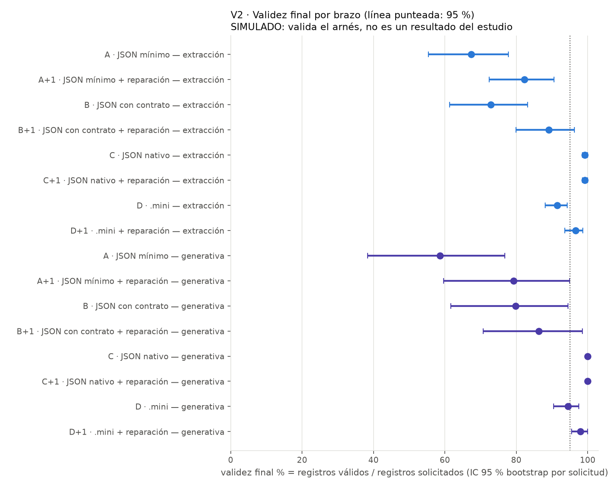
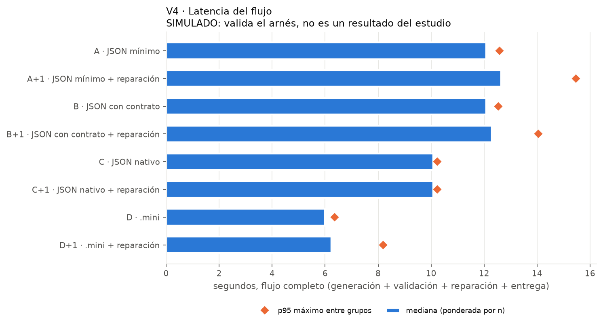

# Resumen del experimento generativo — piloto

> **RESULTADOS SIMULADOS.** Estas cifras provienen del adaptador simulado, cuyas tasas de falla son supuestos del simulador. Solo validan que el arnés funciona de extremo a extremo; **no son resultados del estudio** y no deben citarse como evidencia sobre ningún formato ni modelo.

Muestras: 792 · commit: `f6266308c4` · adaptador: simulado · procedencia: simulado

Estado del estudio: **completo** · celdas {'hecha': 792, 'pendiente': 0, 'bloqueado': 0, 'no_aplicable': 72, 'error_tecnico': 0} · gasto {'gastado_usd': '0', 'incierto_usd': '0', 'llamadas': 607, 'llamadas_huerfanas': 0, 'tope_usd': None}

Validez final = registros válidos / registros SOLICITADOS (los ausentes cuentan como no válidos). IC 95 %: bootstrap de conglomerados por solicitud (nunca por registro o campo). Sintaxis: IC de Wilson por muestra. Los costos dependen de tarifas verificadas; sin ellas son «tarifa no verificada».

## Por brazo

| exp. | tipo | brazo | muestras | sintaxis analizable % [IC95] | cumple contrato % (de los aceptados) | exactitud de contenido % [IC95 solic.] | validez final % [IC95 solic.] | incorrectos sin aviso % | perdidos sin aviso % | perdidos con aviso % | tok. entrada | tok. salida | latencia mediana s | p95 s | n | USD / 1000 válidos |
|---|---|---|---|---|---|---|---|---|---|---|---|---|---|---|---|---|
| v2 | extraccion | A | 54 | 74.1 [61.1–83.9] | 92.59 | 66.8 [55.0–77.3] | 67.3 [55.4–77.8] | 5.89 | 1.35 | 25.93 | 1064.7 | 1044.5 | 12.112 | 12.59 | 54 | — |
| v2 | extraccion | A+1 | 54 | 87.0 [75.6–93.6] | 100.0 | 81.7 [72.0–90.1] | 82.3 [72.4–90.6] | 0.67 | 1.01 | 16.81 | 1245.9 | 1106.0 | 12.483 | 15.471 | 54 | — |
| v2 | extraccion | B | 54 | 75.9 [63.0–85.4] | 97.3 | 71.9 [60.4–82.2] | 72.9 [61.3–83.2] | 3.03 | 1.01 | 24.07 | 1272.7 | 1060.4 | 12.107 | 12.543 | 54 | — |
| v2 | extraccion | B+1 | 54 | 90.7 [80.1–96.0] | 100.0 | 88.0 [79.0–95.0] | 89.1 [80.0–96.3] | 1.01 | 1.18 | 9.76 | 1445.4 | 1094.4 | 12.379 | 14.055 | 54 | — |
| v2 | extraccion | C | 36 | 100.0 [90.4–100.0] | 100.0 | 97.5 [95.7–99.2] | 99.2 [98.5–100.0] | 1.77 | 0.76 | 0.0 | 1272.7 | 848.2 | 10.134 | 10.238 | 36 | — |
| v2 | extraccion | C+1 | 36 | 100.0 [90.4–100.0] | 100.0 | 97.5 [95.7–99.2] | 99.2 [98.5–100.0] | 1.77 | 0.76 | 0.0 | 1272.7 | 848.2 | 10.134 | 10.238 | 36 | — |
| v2 | extraccion | D | 54 | 100.0 [93.4–100.0] | 100.0 | 88.9 [84.8–92.4] | 91.4 [88.0–94.3] | 2.53 | 0.17 | 8.42 | 1543.0 | 481.9 | 5.931 | 6.356 | 54 | — |
| v2 | extraccion | D+1 | 54 | 100.0 [93.4–100.0] | 100.0 | 94.1 [91.1–96.6] | 96.6 [93.6–98.7] | 2.53 | 0.84 | 2.53 | 1915.7 | 516.6 | 6.244 | 7.688 | 54 | — |
| v2 | generativa | A | 18 | 66.7 [43.8–83.7] | 88.55 | — | 58.6 [38.4–76.8] | 7.58 | 0.51 | 33.33 | 138.0 | 1047.2 | 11.985 | 12.08 | 18 | — |
| v2 | generativa | A+1 | 18 | 83.3 [60.8–94.2] | 100.0 | — | 79.3 [59.6–95.0] | 0.0 | 1.01 | 19.7 | 403.4 | 1154.8 | 13.126 | 14.974 | 18 | — |
| v2 | generativa | B | 18 | 83.3 [60.8–94.2] | 97.53 | — | 79.8 [61.6–94.4] | 2.02 | 1.52 | 16.67 | 358.0 | 1053.2 | 12.003 | 12.114 | 18 | — |
| v2 | generativa | B+1 | 18 | 88.9 [67.2–96.9] | 100.0 | — | 86.4 [70.7–98.5] | 0.0 | 0.51 | 13.13 | 503.7 | 1076.9 | 12.011 | 13.31 | 18 | — |
| v2 | generativa | C | 12 | 100.0 [75.8–100.0] | 100.0 | — | 100.0 [100.0–100.0] | 0.0 | 0.0 | 0.0 | 358.0 | 878.8 | 9.913 | 9.96 | 12 | — |
| v2 | generativa | C+1 | 12 | 100.0 [75.8–100.0] | 100.0 | — | 100.0 [100.0–100.0] | 0.0 | 0.0 | 0.0 | 358.0 | 878.8 | 9.913 | 9.96 | 12 | — |
| v2 | generativa | D | 18 | 100.0 [82.4–100.0] | 100.0 | — | 94.4 [90.4–97.5] | 0.0 | 0.0 | 5.56 | 646.0 | 538.1 | 6.159 | 6.253 | 18 | — |
| v2 | generativa | D+1 | 18 | 100.0 [82.4–100.0] | 100.0 | — | 98.0 [95.5–100.0] | 0.0 | 0.0 | 2.02 | 980.8 | 570.9 | 6.224 | 8.194 | 18 | — |
| v3b | extraccion | A | 27 | 0.0 [0.0–12.5] | — | 0.0 [0.0–0.0] | 0.0 [0.0–0.0] | 0.0 | 0.0 | 100.0 | 1064.7 | 477.1 | 5.684 | 5.847 | 27 | — |
| v3b | extraccion | A+1 | 27 | 100.0 [87.5–100.0] | 100.0 | 34.0 [32.3–35.7] | 34.3 [32.7–35.7] | 0.34 | 0.0 | 65.66 | 1400.7 | 505.1 | 6.04 | 7.063 | 27 | — |
| v3b | extraccion | B | 27 | 0.0 [0.0–12.5] | — | 0.0 [0.0–0.0] | 0.0 [0.0–0.0] | 0.0 | 0.0 | 100.0 | 1272.7 | 480.7 | 5.725 | 5.847 | 27 | — |
| v3b | extraccion | B+1 | 27 | 100.0 [87.5–100.0] | 100.0 | 36.4 [36.4–36.4] | 36.4 [36.4–36.4] | 0.0 | 0.0 | 63.64 | 1805.4 | 502.1 | 6.033 | 7.052 | 27 | — |
| v3b | extraccion | C | 18 | 0.0 [0.0–17.6] | — | 0.0 [0.0–0.0] | 0.0 [0.0–0.0] | 0.0 | 0.0 | 100.0 | 1272.7 | 481.0 | 5.692 | 5.826 | 18 | — |
| v3b | extraccion | C+1 | 18 | 72.2 [49.1–87.5] | 100.0 | 35.9 [25.8–45.5] | 36.4 [26.3–46.0] | 0.51 | 0.0 | 63.64 | 1614.6 | 484.6 | 5.79 | 6.091 | 18 | — |
| v3b | extraccion | D | 27 | 100.0 [87.5–100.0] | 100.0 | 81.5 [75.1–86.5] | 82.8 [76.8–87.9] | 1.35 | 0.0 | 17.17 | 1543.0 | 457.5 | 5.672 | 5.837 | 27 | — |
| v3b | extraccion | D+1 | 27 | 100.0 [87.5–100.0] | 100.0 | 85.2 [78.8–89.9] | 86.5 [80.1–91.2] | 1.35 | 0.0 | 13.47 | 2152.3 | 513.0 | 6.469 | 7.59 | 27 | — |
| v3b | generativa | A | 9 | 0.0 [0.0–29.9] | — | — | 0.0 [0.0–0.0] | 0.0 | 0.0 | 100.0 | 138.0 | 486.0 | 5.577 | 5.635 | 9 | — |
| v3b | generativa | A+1 | 9 | 100.0 [70.1–100.0] | 100.0 | — | 35.4 [32.3–39.4] | 0.0 | 0.0 | 64.65 | 492.2 | 531.0 | 5.928 | 6.922 | 9 | — |
| v3b | generativa | B | 9 | 0.0 [0.0–29.9] | — | — | 0.0 [0.0–0.0] | 0.0 | 0.0 | 100.0 | 358.0 | 486.0 | 5.578 | 5.623 | 9 | — |
| v3b | generativa | B+1 | 9 | 100.0 [70.1–100.0] | 100.0 | — | 35.4 [33.3–36.4] | 0.0 | 0.0 | 64.65 | 912.4 | 509.1 | 5.947 | 6.851 | 9 | — |
| v3b | generativa | C | 6 | 0.0 [0.0–39.0] | — | — | 0.0 [0.0–0.0] | 0.0 | 0.0 | 100.0 | 358.0 | 486.0 | 5.609 | 5.649 | 6 | — |
| v3b | generativa | C+1 | 6 | 0.0 [0.0–39.0] | — | — | 0.0 [0.0–0.0] | 0.0 | 0.0 | 100.0 | 358.0 | 486.0 | 5.609 | 5.649 | 6 | — |
| v3b | generativa | D | 9 | 100.0 [70.1–100.0] | 100.0 | — | 80.8 [71.7–87.9] | 0.0 | 1.01 | 18.18 | 646.0 | 485.9 | 5.595 | 5.622 | 9 | — |
| v3b | generativa | D+1 | 9 | 100.0 [70.1–100.0] | 100.0 | — | 84.8 [77.8–89.9] | 0.0 | 1.01 | 14.14 | 1310.9 | 547.2 | 5.968 | 7.595 | 9 | — |

## Por brazo y modelo

| exp. | tipo | brazo | modelo | muestras | sintaxis analizable % [IC95] | cumple contrato % (de los aceptados) | exactitud de contenido % [IC95 solic.] | validez final % [IC95 solic.] | incorrectos sin aviso % | perdidos sin aviso % | perdidos con aviso % | tok. entrada | tok. salida | latencia mediana s | p95 s | n | USD / 1000 válidos |
|---|---|---|---|---|---|---|---|---|---|---|---|---|---|---|---|---|---|
| v2 | extraccion | A | anthropic:claude-haiku-4-5 | 18 | 83.3 [60.8–94.2] | 98.79 | 81.8 [64.1–98.5] | 82.3 [65.2–99.0] | 1.52 | 0.0 | 16.67 | 1064.7 | 1031.2 | 12.137 | 12.59 | 18 | — |
| v2 | extraccion | A | groq:llama-3.3-70b-versatile | 18 | 61.1 [38.6–79.7] | 82.91 | 49.0 [30.8–66.2] | 49.0 [30.8–66.2] | 10.1 | 2.02 | 38.89 | 1064.7 | 1052.8 | 12.127 | 12.624 | 18 | — |
| v2 | extraccion | A | openai:gpt-4.1-mini | 18 | 77.8 [54.8–91.0] | 93.33 | 69.7 [52.0–85.9] | 70.7 [52.0–86.9] | 6.06 | 2.02 | 22.22 | 1064.7 | 1049.6 | 11.596 | 12.635 | 18 | — |
| v2 | extraccion | A+1 | anthropic:claude-haiku-4-5 | 18 | 88.9 [67.2–96.9] | 100.0 | 84.3 [66.7–99.5] | 84.8 [66.7–100.0] | 0.51 | 0.0 | 15.15 | 1113.2 | 1040.4 | 12.138 | 13.727 | 18 | — |
| v2 | extraccion | A+1 | groq:llama-3.3-70b-versatile | 18 | 77.8 [54.8–91.0] | 100.0 | 71.2 [51.5–87.4] | 71.7 [52.5–87.9] | 0.5 | 1.51 | 27.14 | 1348.7 | 1156.1 | 13.256 | 15.881 | 18 | — |
| v2 | extraccion | A+1 | openai:gpt-4.1-mini | 18 | 94.4 [74.2–99.0] | 100.0 | 89.4 [78.3–97.0] | 90.4 [79.3–98.0] | 1.01 | 1.52 | 8.08 | 1275.7 | 1121.7 | 12.535 | 16.542 | 18 | — |
| v2 | extraccion | B | anthropic:claude-haiku-4-5 | 18 | 88.9 [67.2–96.9] | 98.86 | 87.4 [70.7–99.0] | 87.4 [70.7–99.0] | 1.01 | 0.51 | 11.11 | 1272.7 | 1066.6 | 12.126 | 12.547 | 18 | — |
| v2 | extraccion | B | groq:llama-3.3-70b-versatile | 18 | 72.2 [49.1–87.5] | 94.96 | 64.7 [45.0–82.3] | 66.7 [46.5–84.3] | 5.56 | 2.02 | 27.78 | 1272.7 | 1046.6 | 11.604 | 12.61 | 18 | — |
| v2 | extraccion | B | openai:gpt-4.1-mini | 18 | 66.7 [43.8–83.7] | 97.71 | 63.6 [41.4–84.3] | 64.7 [41.9–86.4] | 2.53 | 0.51 | 33.33 | 1272.7 | 1067.9 | 12.131 | 12.533 | 18 | — |
| v2 | extraccion | B+1 | anthropic:claude-haiku-4-5 | 18 | 100.0 [82.4–100.0] | 100.0 | 99.5 [98.5–100.0] | 99.5 [98.5–100.0] | 0.0 | 0.51 | 0.0 | 1385.4 | 1085.6 | 12.477 | 13.426 | 18 | — |
| v2 | extraccion | B+1 | groq:llama-3.3-70b-versatile | 18 | 88.9 [67.2–96.9] | 100.0 | 83.8 [69.2–95.0] | 85.9 [70.2–97.0] | 2.02 | 2.53 | 11.62 | 1527.8 | 1102.6 | 12.388 | 14.737 | 18 | — |
| v2 | extraccion | B+1 | openai:gpt-4.1-mini | 18 | 83.3 [60.8–94.2] | 100.0 | 80.8 [63.6–96.0] | 81.8 [64.7–97.5] | 1.01 | 0.51 | 17.68 | 1422.9 | 1095.1 | 12.289 | 14.5 | 18 | — |
| v2 | extraccion | C | anthropic:claude-haiku-4-5 | 18 | 100.0 [82.4–100.0] | 100.0 | 98.0 [95.5–100.0] | 99.5 [98.5–100.0] | 1.52 | 0.51 | 0.0 | 1272.7 | 850.9 | 10.156 | 10.254 | 18 | — |
| v2 | extraccion | C | openai:gpt-4.1-mini | 18 | 100.0 [82.4–100.0] | 100.0 | 97.0 [93.9–99.5] | 99.0 [97.5–100.0] | 2.02 | 1.01 | 0.0 | 1272.7 | 845.6 | 10.118 | 10.238 | 18 | — |
| v2 | extraccion | C+1 | anthropic:claude-haiku-4-5 | 18 | 100.0 [82.4–100.0] | 100.0 | 98.0 [95.5–100.0] | 99.5 [98.5–100.0] | 1.52 | 0.51 | 0.0 | 1272.7 | 850.9 | 10.156 | 10.254 | 18 | — |
| v2 | extraccion | C+1 | openai:gpt-4.1-mini | 18 | 100.0 [82.4–100.0] | 100.0 | 97.0 [93.9–99.5] | 99.0 [97.5–100.0] | 2.02 | 1.01 | 0.0 | 1272.7 | 845.6 | 10.118 | 10.238 | 18 | — |
| v2 | extraccion | D | anthropic:claude-haiku-4-5 | 18 | 100.0 [82.4–100.0] | 100.0 | 97.5 [95.0–99.5] | 97.5 [95.0–99.5] | 0.0 | 0.0 | 2.53 | 1543.0 | 490.3 | 5.987 | 6.345 | 18 | — |
| v2 | extraccion | D | groq:llama-3.3-70b-versatile | 18 | 100.0 [82.4–100.0] | 100.0 | 79.8 [71.2–86.4] | 83.3 [74.8–89.9] | 3.54 | 0.0 | 16.67 | 1543.0 | 465.6 | 5.464 | 6.441 | 18 | — |
| v2 | extraccion | D | openai:gpt-4.1-mini | 18 | 100.0 [82.4–100.0] | 100.0 | 89.4 [83.8–93.9] | 93.4 [90.4–96.0] | 4.04 | 0.51 | 6.06 | 1543.0 | 489.8 | 5.944 | 6.359 | 18 | — |
| v2 | extraccion | D+1 | anthropic:claude-haiku-4-5 | 18 | 100.0 [82.4–100.0] | 100.0 | 99.5 [98.5–100.0] | 99.5 [98.5–100.0] | 0.0 | 0.51 | 0.0 | 1703.3 | 502.2 | 6.009 | 7.288 | 18 | — |
| v2 | extraccion | D+1 | groq:llama-3.3-70b-versatile | 18 | 100.0 [82.4–100.0] | 100.0 | 87.9 [80.3–93.4] | 91.4 [83.8–97.0] | 3.54 | 1.52 | 7.07 | 2106.9 | 523.8 | 6.248 | 7.756 | 18 | — |
| v2 | extraccion | D+1 | openai:gpt-4.1-mini | 18 | 100.0 [82.4–100.0] | 100.0 | 95.0 [91.9–97.5] | 99.0 [97.5–100.0] | 4.04 | 0.51 | 0.51 | 1937.0 | 523.9 | 6.377 | 7.738 | 18 | — |
| v2 | generativa | A | anthropic:claude-haiku-4-5 | 6 | 100.0 [61.0–100.0] | 93.94 | — | 93.9 [90.9–97.0] | 6.06 | 0.0 | 0.0 | 138.0 | 1068.0 | 11.986 | 12.038 | 6 | — |
| v2 | generativa | A | groq:llama-3.3-70b-versatile | 6 | 50.0 [18.8–81.2] | 84.38 | — | 40.9 [10.6–75.8] | 7.58 | 1.52 | 50.0 | 138.0 | 1019.2 | 11.485 | 11.999 | 6 | — |
| v2 | generativa | A | openai:gpt-4.1-mini | 6 | 50.0 [18.8–81.2] | 81.82 | — | 40.9 [12.1–74.2] | 9.09 | 0.0 | 50.0 | 138.0 | 1054.3 | 12.013 | 12.08 | 6 | — |
| v2 | generativa | A+1 | anthropic:claude-haiku-4-5 | 6 | 100.0 [61.0–100.0] | 100.0 | — | 100.0 [100.0–100.0] | 0.0 | 0.0 | 0.0 | 335.0 | 1121.8 | 13.095 | 13.194 | 6 | — |
| v2 | generativa | A+1 | groq:llama-3.3-70b-versatile | 6 | 66.7 [30.0–90.3] | 100.0 | — | 62.1 [27.3–95.5] | 0.0 | 1.52 | 36.36 | 405.2 | 1142.8 | 12.905 | 14.974 | 6 | — |
| v2 | generativa | A+1 | openai:gpt-4.1-mini | 6 | 83.3 [43.6–97.0] | 100.0 | — | 75.8 [43.9–95.5] | 0.0 | 1.52 | 22.73 | 470.2 | 1199.7 | 13.918 | 14.854 | 6 | — |
| v2 | generativa | B | anthropic:claude-haiku-4-5 | 6 | 100.0 [61.0–100.0] | 100.0 | — | 100.0 [100.0–100.0] | 0.0 | 0.0 | 0.0 | 358.0 | 1068.0 | 11.963 | 12.04 | 6 | — |
| v2 | generativa | B | groq:llama-3.3-70b-versatile | 6 | 83.3 [43.6–97.0] | 94.23 | — | 74.2 [42.4–95.5] | 4.55 | 4.55 | 16.67 | 358.0 | 1019.7 | 11.99 | 12.042 | 6 | — |
| v2 | generativa | B | openai:gpt-4.1-mini | 6 | 66.7 [30.0–90.3] | 97.73 | — | 65.2 [16.7–98.5] | 1.52 | 0.0 | 33.33 | 358.0 | 1072.0 | 12.031 | 12.114 | 6 | — |
| v2 | generativa | B+1 | anthropic:claude-haiku-4-5 | 6 | 100.0 [61.0–100.0] | 100.0 | — | 100.0 [100.0–100.0] | 0.0 | 0.0 | 0.0 | 358.0 | 1068.0 | 11.963 | 12.04 | 6 | — |
| v2 | generativa | B+1 | groq:llama-3.3-70b-versatile | 6 | 100.0 [61.0–100.0] | 100.0 | — | 92.4 [83.3–98.5] | 0.0 | 1.52 | 6.06 | 708.0 | 1076.8 | 12.056 | 13.31 | 6 | — |
| v2 | generativa | B+1 | openai:gpt-4.1-mini | 6 | 66.7 [30.0–90.3] | 100.0 | — | 66.7 [16.7–100.0] | 0.0 | 0.0 | 33.33 | 445.0 | 1085.8 | 12.031 | 13.166 | 6 | — |
| v2 | generativa | C | anthropic:claude-haiku-4-5 | 6 | 100.0 [61.0–100.0] | 100.0 | — | 100.0 [100.0–100.0] | 0.0 | 0.0 | 0.0 | 358.0 | 879.0 | 9.915 | 9.96 | 6 | — |
| v2 | generativa | C | openai:gpt-4.1-mini | 6 | 100.0 [61.0–100.0] | 100.0 | — | 100.0 [100.0–100.0] | 0.0 | 0.0 | 0.0 | 358.0 | 878.7 | 9.913 | 9.959 | 6 | — |
| v2 | generativa | C+1 | anthropic:claude-haiku-4-5 | 6 | 100.0 [61.0–100.0] | 100.0 | — | 100.0 [100.0–100.0] | 0.0 | 0.0 | 0.0 | 358.0 | 879.0 | 9.915 | 9.96 | 6 | — |
| v2 | generativa | C+1 | openai:gpt-4.1-mini | 6 | 100.0 [61.0–100.0] | 100.0 | — | 100.0 [100.0–100.0] | 0.0 | 0.0 | 0.0 | 358.0 | 878.7 | 9.913 | 9.959 | 6 | — |
| v2 | generativa | D | anthropic:claude-haiku-4-5 | 6 | 100.0 [61.0–100.0] | 100.0 | — | 100.0 [100.0–100.0] | 0.0 | 0.0 | 0.0 | 646.0 | 538.3 | 6.159 | 6.253 | 6 | — |
| v2 | generativa | D | groq:llama-3.3-70b-versatile | 6 | 100.0 [61.0–100.0] | 100.0 | — | 84.8 [78.8–89.4] | 0.0 | 0.0 | 15.15 | 646.0 | 537.2 | 6.151 | 6.251 | 6 | — |
| v2 | generativa | D | openai:gpt-4.1-mini | 6 | 100.0 [61.0–100.0] | 100.0 | — | 98.5 [95.5–100.0] | 0.0 | 0.0 | 1.52 | 646.0 | 538.7 | 6.167 | 6.242 | 6 | — |
| v2 | generativa | D+1 | anthropic:claude-haiku-4-5 | 6 | 100.0 [61.0–100.0] | 100.0 | — | 100.0 [100.0–100.0] | 0.0 | 0.0 | 0.0 | 646.0 | 538.3 | 6.159 | 6.253 | 6 | — |
| v2 | generativa | D+1 | groq:llama-3.3-70b-versatile | 6 | 100.0 [61.0–100.0] | 100.0 | — | 93.9 [87.9–98.5] | 0.0 | 0.0 | 6.06 | 1415.3 | 624.8 | 7.318 | 8.194 | 6 | — |
| v2 | generativa | D+1 | openai:gpt-4.1-mini | 6 | 100.0 [61.0–100.0] | 100.0 | — | 100.0 [100.0–100.0] | 0.0 | 0.0 | 0.0 | 881.2 | 549.7 | 6.191 | 7.049 | 6 | — |
| v3b | extraccion | A | anthropic:claude-haiku-4-5 | 9 | 0.0 [0.0–29.9] | — | 0.0 [0.0–0.0] | 0.0 [0.0–0.0] | 0.0 | 0.0 | 100.0 | 1064.7 | 480.7 | 5.679 | 5.85 | 9 | — |
| v3b | extraccion | A | groq:llama-3.3-70b-versatile | 9 | 0.0 [0.0–29.9] | — | 0.0 [0.0–0.0] | 0.0 [0.0–0.0] | 0.0 | 0.0 | 100.0 | 1064.7 | 469.9 | 5.684 | 5.847 | 9 | — |
| v3b | extraccion | A | openai:gpt-4.1-mini | 9 | 0.0 [0.0–29.9] | — | 0.0 [0.0–0.0] | 0.0 [0.0–0.0] | 0.0 | 0.0 | 100.0 | 1064.7 | 480.9 | 5.686 | 5.796 | 9 | — |
| v3b | extraccion | A+1 | anthropic:claude-haiku-4-5 | 9 | 100.0 [70.1–100.0] | 100.0 | 36.4 [36.4–36.4] | 36.4 [36.4–36.4] | 0.0 | 0.0 | 63.64 | 1380.2 | 495.6 | 6.074 | 6.93 | 9 | — |
| v3b | extraccion | A+1 | groq:llama-3.3-70b-versatile | 9 | 100.0 [70.1–100.0] | 100.0 | 30.3 [26.3–34.3] | 30.3 [26.3–34.3] | 0.0 | 0.0 | 69.7 | 1442.8 | 524.2 | 6.043 | 7.063 | 9 | — |
| v3b | extraccion | A+1 | openai:gpt-4.1-mini | 9 | 100.0 [70.1–100.0] | 100.0 | 35.4 [33.3–36.4] | 36.4 [36.4–36.4] | 1.01 | 0.0 | 63.64 | 1379.0 | 495.7 | 5.983 | 7.064 | 9 | — |
| v3b | extraccion | B | anthropic:claude-haiku-4-5 | 9 | 0.0 [0.0–29.9] | — | 0.0 [0.0–0.0] | 0.0 [0.0–0.0] | 0.0 | 0.0 | 100.0 | 1272.7 | 480.7 | 5.742 | 5.847 | 9 | — |
| v3b | extraccion | B | groq:llama-3.3-70b-versatile | 9 | 0.0 [0.0–29.9] | — | 0.0 [0.0–0.0] | 0.0 [0.0–0.0] | 0.0 | 0.0 | 100.0 | 1272.7 | 480.8 | 5.711 | 5.769 | 9 | — |
| v3b | extraccion | B | openai:gpt-4.1-mini | 9 | 0.0 [0.0–29.9] | — | 0.0 [0.0–0.0] | 0.0 [0.0–0.0] | 0.0 | 0.0 | 100.0 | 1272.7 | 480.8 | 5.725 | 5.854 | 9 | — |
| v3b | extraccion | B+1 | anthropic:claude-haiku-4-5 | 9 | 100.0 [70.1–100.0] | 100.0 | 36.4 [36.4–36.4] | 36.4 [36.4–36.4] | 0.0 | 0.0 | 63.64 | 1795.3 | 495.6 | 6.052 | 6.991 | 9 | — |
| v3b | extraccion | B+1 | groq:llama-3.3-70b-versatile | 9 | 100.0 [70.1–100.0] | 100.0 | 36.4 [36.4–36.4] | 36.4 [36.4–36.4] | 0.0 | 0.0 | 63.64 | 1810.9 | 505.2 | 5.987 | 7.094 | 9 | — |
| v3b | extraccion | B+1 | openai:gpt-4.1-mini | 9 | 100.0 [70.1–100.0] | 100.0 | 36.4 [36.4–36.4] | 36.4 [36.4–36.4] | 0.0 | 0.0 | 63.64 | 1810.0 | 505.6 | 6.094 | 6.971 | 9 | — |
| v3b | extraccion | C | anthropic:claude-haiku-4-5 | 9 | 0.0 [0.0–29.9] | — | 0.0 [0.0–0.0] | 0.0 [0.0–0.0] | 0.0 | 0.0 | 100.0 | 1272.7 | 481.0 | 5.742 | 5.811 | 9 | — |
| v3b | extraccion | C | openai:gpt-4.1-mini | 9 | 0.0 [0.0–29.9] | — | 0.0 [0.0–0.0] | 0.0 [0.0–0.0] | 0.0 | 0.0 | 100.0 | 1272.7 | 481.0 | 5.665 | 5.826 | 9 | — |
| v3b | extraccion | C+1 | anthropic:claude-haiku-4-5 | 9 | 77.8 [45.3–93.7] | 100.0 | 38.4 [22.2–50.5] | 39.4 [23.2–51.5] | 1.01 | 0.0 | 60.61 | 1639.1 | 484.9 | 5.78 | 6.091 | 9 | — |
| v3b | extraccion | C+1 | openai:gpt-4.1-mini | 9 | 66.7 [35.4–87.9] | 100.0 | 33.3 [17.2–47.5] | 33.3 [17.2–47.5] | 0.0 | 0.0 | 66.67 | 1590.0 | 484.3 | 5.798 | 5.981 | 9 | — |
| v3b | extraccion | D | anthropic:claude-haiku-4-5 | 9 | 100.0 [70.1–100.0] | 100.0 | 86.9 [81.8–91.9] | 88.9 [82.8–93.9] | 2.02 | 0.0 | 11.11 | 1543.0 | 469.8 | 5.672 | 5.854 | 9 | — |
| v3b | extraccion | D | groq:llama-3.3-70b-versatile | 9 | 100.0 [70.1–100.0] | 100.0 | 75.8 [68.7–81.8] | 77.8 [71.7–82.8] | 2.02 | 0.0 | 22.22 | 1543.0 | 465.2 | 5.665 | 5.824 | 9 | — |
| v3b | extraccion | D | openai:gpt-4.1-mini | 9 | 100.0 [70.1–100.0] | 100.0 | 81.8 [66.7–92.9] | 81.8 [66.7–92.9] | 0.0 | 0.0 | 18.18 | 1543.0 | 437.4 | 5.706 | 5.837 | 9 | — |
| v3b | extraccion | D+1 | anthropic:claude-haiku-4-5 | 9 | 100.0 [70.1–100.0] | 100.0 | 87.9 [82.8–92.9] | 89.9 [83.8–95.0] | 2.02 | 0.0 | 10.1 | 2074.2 | 506.9 | 6.469 | 6.895 | 9 | — |
| v3b | extraccion | D+1 | groq:llama-3.3-70b-versatile | 9 | 100.0 [70.1–100.0] | 100.0 | 82.8 [77.8–86.9] | 84.8 [80.8–87.9] | 2.02 | 0.0 | 15.15 | 2299.1 | 552.4 | 6.705 | 7.591 | 9 | — |
| v3b | extraccion | D+1 | openai:gpt-4.1-mini | 9 | 100.0 [70.1–100.0] | 100.0 | 84.8 [68.7–96.0] | 84.8 [68.7–96.0] | 0.0 | 0.0 | 15.15 | 2083.4 | 479.7 | 6.399 | 7.59 | 9 | — |
| v3b | generativa | A | anthropic:claude-haiku-4-5 | 3 | 0.0 [0.0–56.1] | — | — | 0.0 [0.0–0.0] | 0.0 | 0.0 | 100.0 | 138.0 | 486.0 | 5.593 | 5.635 | 3 | — |
| v3b | generativa | A | groq:llama-3.3-70b-versatile | 3 | 0.0 [0.0–56.1] | — | — | 0.0 [0.0–0.0] | 0.0 | 0.0 | 100.0 | 138.0 | 486.0 | 5.595 | 5.616 | 3 | — |
| v3b | generativa | A | openai:gpt-4.1-mini | 3 | 0.0 [0.0–56.1] | — | — | 0.0 [0.0–0.0] | 0.0 | 0.0 | 100.0 | 138.0 | 486.0 | 5.568 | 5.577 | 3 | — |
| v3b | generativa | A+1 | anthropic:claude-haiku-4-5 | 3 | 100.0 [43.9–100.0] | 100.0 | — | 36.4 [36.4–36.4] | 0.0 | 0.0 | 63.64 | 447.0 | 491.0 | 5.916 | 5.928 | 3 | — |
| v3b | generativa | A+1 | groq:llama-3.3-70b-versatile | 3 | 100.0 [43.9–100.0] | 100.0 | — | 36.4 [27.3–45.5] | 0.0 | 0.0 | 63.64 | 501.0 | 551.0 | 6.853 | 6.856 | 3 | — |
| v3b | generativa | A+1 | openai:gpt-4.1-mini | 3 | 100.0 [43.9–100.0] | 100.0 | — | 33.3 [27.3–36.4] | 0.0 | 0.0 | 66.67 | 528.7 | 551.0 | 6.85 | 6.922 | 3 | — |
| v3b | generativa | B | anthropic:claude-haiku-4-5 | 3 | 0.0 [0.0–56.1] | — | — | 0.0 [0.0–0.0] | 0.0 | 0.0 | 100.0 | 358.0 | 486.0 | 5.572 | 5.578 | 3 | — |
| v3b | generativa | B | groq:llama-3.3-70b-versatile | 3 | 0.0 [0.0–56.1] | — | — | 0.0 [0.0–0.0] | 0.0 | 0.0 | 100.0 | 358.0 | 486.0 | 5.599 | 5.623 | 3 | — |
| v3b | generativa | B | openai:gpt-4.1-mini | 3 | 0.0 [0.0–56.1] | — | — | 0.0 [0.0–0.0] | 0.0 | 0.0 | 100.0 | 358.0 | 486.0 | 5.559 | 5.593 | 3 | — |
| v3b | generativa | B+1 | anthropic:claude-haiku-4-5 | 3 | 100.0 [43.9–100.0] | 100.0 | — | 33.3 [27.3–36.4] | 0.0 | 0.0 | 66.67 | 928.7 | 515.3 | 5.929 | 6.669 | 3 | — |
| v3b | generativa | B+1 | groq:llama-3.3-70b-versatile | 3 | 100.0 [43.9–100.0] | 100.0 | — | 36.4 [36.4–36.4] | 0.0 | 0.0 | 63.64 | 926.3 | 521.0 | 5.955 | 6.851 | 3 | — |
| v3b | generativa | B+1 | openai:gpt-4.1-mini | 3 | 100.0 [43.9–100.0] | 100.0 | — | 36.4 [36.4–36.4] | 0.0 | 0.0 | 63.64 | 882.3 | 491.0 | 5.885 | 5.947 | 3 | — |
| v3b | generativa | C | anthropic:claude-haiku-4-5 | 3 | 0.0 [0.0–56.1] | — | — | 0.0 [0.0–0.0] | 0.0 | 0.0 | 100.0 | 358.0 | 486.0 | 5.572 | 5.591 | 3 | — |
| v3b | generativa | C | openai:gpt-4.1-mini | 3 | 0.0 [0.0–56.1] | — | — | 0.0 [0.0–0.0] | 0.0 | 0.0 | 100.0 | 358.0 | 486.0 | 5.63 | 5.649 | 3 | — |
| v3b | generativa | C+1 | anthropic:claude-haiku-4-5 | 3 | 0.0 [0.0–56.1] | — | — | 0.0 [0.0–0.0] | 0.0 | 0.0 | 100.0 | 358.0 | 486.0 | 5.572 | 5.591 | 3 | — |
| v3b | generativa | C+1 | openai:gpt-4.1-mini | 3 | 0.0 [0.0–56.1] | — | — | 0.0 [0.0–0.0] | 0.0 | 0.0 | 100.0 | 358.0 | 486.0 | 5.63 | 5.649 | 3 | — |
| v3b | generativa | D | anthropic:claude-haiku-4-5 | 3 | 100.0 [43.9–100.0] | 100.0 | — | 90.9 [90.9–90.9] | 0.0 | 0.0 | 9.09 | 646.0 | 486.0 | 5.595 | 5.599 | 3 | — |
| v3b | generativa | D | groq:llama-3.3-70b-versatile | 3 | 100.0 [43.9–100.0] | 100.0 | — | 78.8 [63.6–90.9] | 0.0 | 0.0 | 21.21 | 646.0 | 486.0 | 5.621 | 5.622 | 3 | — |
| v3b | generativa | D | openai:gpt-4.1-mini | 3 | 100.0 [43.9–100.0] | 100.0 | — | 72.7 [63.6–90.9] | 0.0 | 3.03 | 24.24 | 646.0 | 485.7 | 5.586 | 5.59 | 3 | — |
| v3b | generativa | D+1 | anthropic:claude-haiku-4-5 | 3 | 100.0 [43.9–100.0] | 100.0 | — | 90.9 [90.9–90.9] | 0.0 | 0.0 | 9.09 | 1298.0 | 493.0 | 5.894 | 5.968 | 3 | — |
| v3b | generativa | D+1 | groq:llama-3.3-70b-versatile | 3 | 100.0 [43.9–100.0] | 100.0 | — | 81.8 [63.6–90.9] | 0.0 | 0.0 | 18.18 | 1401.0 | 560.3 | 6.583 | 7.595 | 3 | — |
| v3b | generativa | D+1 | openai:gpt-4.1-mini | 3 | 100.0 [43.9–100.0] | 100.0 | — | 81.8 [72.7–90.9] | 0.0 | 3.03 | 15.15 | 1233.7 | 588.3 | 7.542 | 7.544 | 3 | — |

## Desenlaces de la respuesta (recuento de muestras)

| experimento | tipo tarea | brazo | muestras | ok | formato invalido | vacia | truncada | negativa | error tecnico |
|---|---|---|---|---|---|---|---|---|---|
| v2 | extraccion | A | 54 | 40 | 14 | 0 | 0 | 0 | 0 |
| v2 | extraccion | A+1 | 54 | 40 | 14 | 0 | 0 | 0 | 0 |
| v2 | extraccion | B | 54 | 41 | 13 | 0 | 0 | 0 | 0 |
| v2 | extraccion | B+1 | 54 | 41 | 13 | 0 | 0 | 0 | 0 |
| v2 | extraccion | C | 36 | 36 | 0 | 0 | 0 | 0 | 0 |
| v2 | extraccion | C+1 | 36 | 36 | 0 | 0 | 0 | 0 | 0 |
| v2 | extraccion | D | 54 | 25 | 29 | 0 | 0 | 0 | 0 |
| v2 | extraccion | D+1 | 54 | 25 | 29 | 0 | 0 | 0 | 0 |
| v2 | generativa | A | 18 | 12 | 6 | 0 | 0 | 0 | 0 |
| v2 | generativa | A+1 | 18 | 12 | 6 | 0 | 0 | 0 | 0 |
| v2 | generativa | B | 18 | 15 | 3 | 0 | 0 | 0 | 0 |
| v2 | generativa | B+1 | 18 | 15 | 3 | 0 | 0 | 0 | 0 |
| v2 | generativa | C | 12 | 12 | 0 | 0 | 0 | 0 | 0 |
| v2 | generativa | C+1 | 12 | 12 | 0 | 0 | 0 | 0 | 0 |
| v2 | generativa | D | 18 | 10 | 8 | 0 | 0 | 0 | 0 |
| v2 | generativa | D+1 | 18 | 10 | 8 | 0 | 0 | 0 | 0 |
| v3b | extraccion | A | 27 | 0 | 1 | 0 | 26 | 0 | 0 |
| v3b | extraccion | A+1 | 27 | 0 | 1 | 0 | 26 | 0 | 0 |
| v3b | extraccion | B | 27 | 0 | 0 | 0 | 27 | 0 | 0 |
| v3b | extraccion | B+1 | 27 | 0 | 0 | 0 | 27 | 0 | 0 |
| v3b | extraccion | C | 18 | 0 | 0 | 0 | 18 | 0 | 0 |
| v3b | extraccion | C+1 | 18 | 0 | 0 | 0 | 18 | 0 | 0 |
| v3b | extraccion | D | 27 | 3 | 8 | 0 | 16 | 0 | 0 |
| v3b | extraccion | D+1 | 27 | 3 | 8 | 0 | 16 | 0 | 0 |
| v3b | generativa | A | 9 | 0 | 0 | 0 | 9 | 0 | 0 |
| v3b | generativa | A+1 | 9 | 0 | 0 | 0 | 9 | 0 | 0 |
| v3b | generativa | B | 9 | 0 | 0 | 0 | 9 | 0 | 0 |
| v3b | generativa | B+1 | 9 | 0 | 0 | 0 | 9 | 0 | 0 |
| v3b | generativa | C | 6 | 0 | 0 | 0 | 6 | 0 | 0 |
| v3b | generativa | C+1 | 6 | 0 | 0 | 0 | 6 | 0 | 0 |
| v3b | generativa | D | 9 | 1 | 0 | 0 | 8 | 0 | 0 |
| v3b | generativa | D+1 | 9 | 1 | 0 | 0 | 8 | 0 | 0 |

## Comparaciones pareadas (EXPLORATORIAS: sin corrección por comparaciones múltiples)

| exp. | y − x | qué compara | pares | misma respuesta | validez x % | validez y % | dif. pp | IC solic. inf | IC solic. sup | IC doc. inf | IC doc. sup |
|---|---|---|---|---|---|---|---|---|---|---|---|
| v2 | D − B | formato: JSON con contrato frente a .mini | 72 | False | 74.62 | 92.17 | 17.55 | 7.7 | 26.77 | 15.28 | 20.45 |
| v2 | D − C | formato: JSON nativo frente a .mini | 48 | False | 99.43 | 96.4 | -3.03 | -4.92 | -1.52 | -4.55 | -1.52 |
| v2 | D − A | formato: JSON mínimo frente a .mini | 72 | False | 65.15 | 92.17 | 27.02 | 17.93 | 35.98 | 16.29 | 34.22 |
| v2 | D+1 − B+1 | formato con reparación en ambos: JSON con contrato frente a .mini | 72 | False | 88.38 | 96.97 | 8.59 | 1.52 | 16.04 | 6.31 | 10.86 |
| v2 | D+1 − C+1 | formato con reparación en ambos: JSON nativo frente a .mini | 48 | False | 99.43 | 99.43 | 0.0 | -0.95 | 0.95 | -0.57 | 0.57 |
| v2 | D+1 − A+1 | formato con reparación en ambos: JSON mínimo frente a .mini | 72 | False | 81.57 | 96.97 | 15.4 | 7.95 | 23.36 | 8.46 | 20.58 |
| v2 | B − A | contrato en el prompt: A frente a B | 72 | False | 65.15 | 74.62 | 9.47 | -3.28 | 22.1 | -4.29 | 19.07 |
| v2 | C − B | restricción nativa: B frente a C | 48 | False | 77.65 | 99.43 | 21.78 | 11.74 | 33.33 | 12.31 | 29.92 |
| v2 | A+1 − A | estrategia: reparar JSON mínimo | 72 | True | 65.15 | 81.57 | 16.41 | 10.23 | 23.86 | 12.75 | 19.95 |
| v2 | B+1 − B | estrategia: reparar JSON con contrato | 72 | True | 74.62 | 88.38 | 13.76 | 6.69 | 21.84 | 8.96 | 16.67 |
| v2 | C+1 − C | estrategia: reparar JSON nativo | 48 | True | 99.43 | 99.43 | 0.0 | 0.0 | 0.0 | 0.0 | 0.0 |
| v2 | D+1 − D | estrategia: reparar .mini | 72 | True | 92.17 | 96.97 | 4.8 | 3.41 | 6.31 | 3.79 | 6.06 |
| v3b | D − B | formato: JSON con contrato frente a .mini | 36 | False | 0.0 | 82.32 | 82.32 | 77.27 | 86.36 | 74.24 | 89.9 |
| v3b | D − C | formato: JSON nativo frente a .mini | 24 | False | 0.0 | 84.47 | 84.47 | 78.03 | 90.15 | 75.38 | 93.18 |
| v3b | D − A | formato: JSON mínimo frente a .mini | 36 | False | 0.0 | 82.32 | 82.32 | 77.27 | 86.36 | 74.24 | 89.9 |
| v3b | D+1 − B+1 | formato con reparación en ambos: JSON con contrato frente a .mini | 36 | False | 36.11 | 86.11 | 50.0 | 44.95 | 53.79 | 41.67 | 57.83 |
| v3b | D+1 − C+1 | formato con reparación en ambos: JSON nativo frente a .mini | 24 | False | 27.27 | 87.12 | 59.85 | 48.86 | 71.59 | 35.61 | 84.09 |
| v3b | D+1 − A+1 | formato con reparación en ambos: JSON mínimo frente a .mini | 36 | False | 34.6 | 86.11 | 51.52 | 46.46 | 55.3 | 42.93 | 60.1 |
| v3b | B − A | contrato en el prompt: A frente a B | 36 | False | 0.0 | 0.0 | 0.0 | 0.0 | 0.0 | 0.0 | 0.0 |
| v3b | C − B | restricción nativa: B frente a C | 24 | False | 0.0 | 0.0 | 0.0 | 0.0 | 0.0 | 0.0 | 0.0 |
| v3b | A+1 − A | estrategia: reparar JSON mínimo | 36 | True | 0.0 | 34.6 | 34.6 | 33.08 | 36.11 | 33.84 | 35.35 |
| v3b | B+1 − B | estrategia: reparar JSON con contrato | 36 | True | 0.0 | 36.11 | 36.11 | 35.61 | 36.36 | 35.61 | 36.36 |
| v3b | C+1 − C | estrategia: reparar JSON nativo | 24 | True | 0.0 | 27.27 | 27.27 | 16.67 | 36.36 | 4.55 | 50.0 |
| v3b | D+1 − D | estrategia: reparar .mini | 36 | True | 82.32 | 86.11 | 3.79 | 2.02 | 5.81 | 3.28 | 4.04 |

## Reparación selectiva (X frente a X+1, sobre la misma respuesta)

| experimento | tipo tarea | brazo base | brazo reparado | pares | muestras reparadas | llamadas reparacion | registros validos ganados | registros correctos ganados | cambio incorrectos sin aviso | muestras con cambio adverso | registros adversos | lineas no recuperadas | validos sobrescritos | identidades duplicadas finales | identidades inventadas | correcciones rechazadas identidad | reparaciones auditadas | exactas base | exactas reparadas | tokens reparacion total | tokens por registro ganado | salida reparacion vs generacion pct | costo reparacion usd |
|---|---|---|---|---|---|---|---|---|---|---|---|---|---|---|---|---|---|---|---|---|---|---|---|
| v2 | extraccion | A | A+1 | 54 | 26 | 26 | 89 | 88 | -31 | 0 | 0 | 13 | 0 | 0 | 0 | 4 | 26 | 16 | 29 | 13105 | 147.2 | 5.89 | — |
| v2 | extraccion | B | B+1 | 54 | 17 | 17 | 96 | 96 | -12 | 0 | 0 | 3 | 0 | 0 | 0 | 1 | 17 | 23 | 34 | 11165 | 116.3 | 3.21 | — |
| v2 | extraccion | C | C+1 | 36 | 0 | 0 | 0 | 0 | 0 | 0 | 0 | 0 | — | — | — | — | 0 | 29 | 29 | 0 | — | 0.0 | 0.0 |
| v2 | extraccion | D | D+1 | 54 | 28 | 28 | 31 | 31 | 0 | 0 | 0 | 6 | 0 | 0 | 0 | — | 28 | 25 | 34 | 22001 | 709.7 | 7.2 | — |
| v2 | generativa | A | A+1 | 18 | 11 | 11 | 41 | 41 | -15 | 0 | 0 | 5 | 0 | 0 | 0 | 0 | 11 | 4 | 10 | 6715 | 163.8 | 10.28 | — |
| v2 | generativa | B | B+1 | 18 | 5 | 5 | 13 | 13 | -4 | 0 | 0 | 2 | 0 | 0 | 0 | 0 | 5 | 11 | 13 | 3048 | 234.5 | 2.25 | — |
| v2 | generativa | C | C+1 | 12 | 0 | 0 | 0 | 0 | 0 | 0 | 0 | 0 | — | — | — | — | 0 | 12 | 12 | 0 | — | 0.0 | 0.0 |
| v2 | generativa | D | D+1 | 18 | 8 | 8 | 7 | 7 | 0 | 0 | 0 | 3 | 0 | 0 | 0 | — | 8 | 11 | 15 | 6619 | 945.6 | 6.11 | — |
| v3b | extraccion | A | A+1 | 27 | 27 | 27 | 102 | 101 | 1 | 0 | 0 | 32 | 0 | 0 | 0 | 3 | 27 | 0 | 0 | 9828 | 96.4 | 5.87 | — |
| v3b | extraccion | B | B+1 | 27 | 27 | 27 | 108 | 108 | 0 | 0 | 0 | 27 | 0 | 0 | 0 | 0 | 27 | 0 | 0 | 14961 | 138.5 | 4.45 | — |
| v3b | extraccion | C | C+1 | 18 | 13 | 13 | 72 | 71 | 1 | 0 | 0 | 13 | 0 | 0 | 0 | 0 | 13 | 0 | 0 | 6219 | 86.4 | 0.75 | — |
| v3b | extraccion | D | D+1 | 27 | 23 | 23 | 11 | 11 | 0 | 0 | 0 | 27 | 0 | 0 | 0 | — | 23 | 3 | 6 | 17949 | 1631.7 | 12.14 | — |
| v3b | generativa | A | A+1 | 9 | 9 | 9 | 35 | 35 | 0 | 0 | 0 | 11 | 0 | 0 | 0 | 0 | 9 | 0 | 0 | 3593 | 102.7 | 9.26 | — |
| v3b | generativa | B | B+1 | 9 | 9 | 9 | 35 | 35 | 0 | 0 | 0 | 10 | 0 | 0 | 0 | 1 | 9 | 0 | 0 | 5198 | 148.5 | 4.76 | — |
| v3b | generativa | C | C+1 | 6 | 0 | 0 | 0 | 0 | 0 | 0 | 0 | 0 | — | — | — | — | 0 | 0 | 0 | 0 | — | 0.0 | 0.0 |
| v3b | generativa | D | D+1 | 9 | 8 | 8 | 4 | 4 | 0 | 0 | 0 | 8 | 0 | 0 | 0 | — | 8 | 0 | 0 | 6536 | 1634.0 | 12.62 | — |

## V4 · latencia del flujo completo y costo

| experimento | brazo | modelo completo | muestras | latencia flujo mediana s | latencia flujo p95 s | latencia n | latencia excluidas error tecnico | latencia origen | costo usd total | costo solicitud mediana usd | costo por 1000 validos usd | costo nota | validos finales | intentos totales | intentos fallidos |
|---|---|---|---|---|---|---|---|---|---|---|---|---|---|---|---|
| v2 | A | anthropic:claude-haiku-4-5 | 24 | 12.028 | 12.548 | 24 | 0 | simulada | — | — | — | tarifa no verificada | 225 | 24 | 0 |
| v2 | A | groq:llama-3.3-70b-versatile | 24 | 11.991 | 12.58 | 24 | 0 | simulada | — | — | — | tarifa no verificada | 124 | 24 | 0 |
| v2 | A | openai:gpt-4.1-mini | 24 | 11.992 | 12.568 | 24 | 0 | simulada | — | — | — | tarifa no verificada | 167 | 24 | 0 |
| v2 | A+1 | anthropic:claude-haiku-4-5 | 24 | 12.143 | 13.194 | 24 | 0 | simulada | — | — | — | tarifa no verificada | 234 | 31 | 0 |
| v2 | A+1 | groq:llama-3.3-70b-versatile | 24 | 13.256 | 15.471 | 24 | 0 | simulada | — | — | — | tarifa no verificada | 183 | 40 | 0 |
| v2 | A+1 | openai:gpt-4.1-mini | 24 | 12.59 | 14.854 | 24 | 0 | simulada | — | — | — | tarifa no verificada | 229 | 38 | 0 |
| v2 | B | anthropic:claude-haiku-4-5 | 24 | 12.06 | 12.538 | 24 | 0 | simulada | — | — | — | tarifa no verificada | 239 | 24 | 0 |
| v2 | B | groq:llama-3.3-70b-versatile | 24 | 11.822 | 12.543 | 24 | 0 | simulada | — | — | — | tarifa no verificada | 181 | 24 | 0 |
| v2 | B | openai:gpt-4.1-mini | 24 | 12.079 | 12.532 | 24 | 0 | simulada | — | — | — | tarifa no verificada | 171 | 24 | 0 |
| v2 | B+1 | anthropic:claude-haiku-4-5 | 24 | 12.103 | 13.356 | 24 | 0 | simulada | — | — | — | tarifa no verificada | 263 | 28 | 0 |
| v2 | B+1 | groq:llama-3.3-70b-versatile | 24 | 12.149 | 14.055 | 24 | 0 | simulada | — | — | — | tarifa no verificada | 231 | 36 | 0 |
| v2 | B+1 | openai:gpt-4.1-mini | 24 | 12.131 | 13.848 | 24 | 0 | simulada | — | — | — | tarifa no verificada | 206 | 30 | 0 |
| v2 | C | anthropic:claude-haiku-4-5 | 24 | 10.021 | 10.23 | 24 | 0 | simulada | — | — | — | tarifa no verificada | 263 | 24 | 0 |
| v2 | C | openai:gpt-4.1-mini | 24 | 9.925 | 10.236 | 24 | 0 | simulada | — | — | — | tarifa no verificada | 262 | 24 | 0 |
| v2 | C+1 | anthropic:claude-haiku-4-5 | 24 | 10.021 | 10.23 | 24 | 0 | simulada | — | — | — | tarifa no verificada | 263 | 24 | 0 |
| v2 | C+1 | openai:gpt-4.1-mini | 24 | 9.925 | 10.236 | 24 | 0 | simulada | — | — | — | tarifa no verificada | 262 | 24 | 0 |
| v2 | D | anthropic:claude-haiku-4-5 | 24 | 6.07 | 6.34 | 24 | 0 | simulada | — | — | — | tarifa no verificada | 259 | 24 | 0 |
| v2 | D | groq:llama-3.3-70b-versatile | 24 | 5.964 | 6.356 | 24 | 0 | simulada | — | — | — | tarifa no verificada | 221 | 24 | 0 |
| v2 | D | openai:gpt-4.1-mini | 24 | 6.095 | 6.321 | 24 | 0 | simulada | — | — | — | tarifa no verificada | 250 | 24 | 0 |
| v2 | D+1 | anthropic:claude-haiku-4-5 | 24 | 6.139 | 6.881 | 24 | 0 | simulada | — | — | — | tarifa no verificada | 263 | 28 | 0 |
| v2 | D+1 | groq:llama-3.3-70b-versatile | 24 | 6.399 | 7.756 | 24 | 0 | simulada | — | — | — | tarifa no verificada | 243 | 44 | 0 |
| v2 | D+1 | openai:gpt-4.1-mini | 24 | 6.253 | 7.688 | 24 | 0 | simulada | — | — | — | tarifa no verificada | 262 | 36 | 0 |
| v3b | A | anthropic:claude-haiku-4-5 | 12 | 5.643 | 5.85 | 12 | 0 | simulada | — | — | — | tarifa no verificada | 0 | 12 | 0 |
| v3b | A | groq:llama-3.3-70b-versatile | 12 | 5.605 | 5.847 | 12 | 0 | simulada | — | — | — | tarifa no verificada | 0 | 12 | 0 |
| v3b | A | openai:gpt-4.1-mini | 12 | 5.61 | 5.796 | 12 | 0 | simulada | — | — | — | tarifa no verificada | 0 | 12 | 0 |
| v3b | A+1 | anthropic:claude-haiku-4-5 | 12 | 5.936 | 6.93 | 12 | 0 | simulada | — | — | — | tarifa no verificada | 48 | 24 | 0 |
| v3b | A+1 | groq:llama-3.3-70b-versatile | 12 | 6.448 | 7.063 | 12 | 0 | simulada | — | — | — | tarifa no verificada | 42 | 24 | 0 |
| v3b | A+1 | openai:gpt-4.1-mini | 12 | 6.012 | 7.064 | 12 | 0 | simulada | — | — | — | tarifa no verificada | 47 | 24 | 0 |
| v3b | B | anthropic:claude-haiku-4-5 | 12 | 5.632 | 5.847 | 12 | 0 | simulada | — | — | — | tarifa no verificada | 0 | 12 | 0 |
| v3b | B | groq:llama-3.3-70b-versatile | 12 | 5.639 | 5.769 | 12 | 0 | simulada | — | — | — | tarifa no verificada | 0 | 12 | 0 |
| v3b | B | openai:gpt-4.1-mini | 12 | 5.619 | 5.854 | 12 | 0 | simulada | — | — | — | tarifa no verificada | 0 | 12 | 0 |
| v3b | B+1 | anthropic:claude-haiku-4-5 | 12 | 6.023 | 6.991 | 12 | 0 | simulada | — | — | — | tarifa no verificada | 47 | 24 | 0 |
| v3b | B+1 | groq:llama-3.3-70b-versatile | 12 | 5.985 | 7.094 | 12 | 0 | simulada | — | — | — | tarifa no verificada | 48 | 24 | 0 |
| v3b | B+1 | openai:gpt-4.1-mini | 12 | 5.99 | 6.971 | 12 | 0 | simulada | — | — | — | tarifa no verificada | 48 | 24 | 0 |
| v3b | C | anthropic:claude-haiku-4-5 | 12 | 5.656 | 5.811 | 12 | 0 | simulada | — | — | — | tarifa no verificada | 0 | 12 | 0 |
| v3b | C | openai:gpt-4.1-mini | 12 | 5.649 | 5.826 | 12 | 0 | simulada | — | — | — | tarifa no verificada | 0 | 12 | 0 |
| v3b | C+1 | anthropic:claude-haiku-4-5 | 12 | 5.682 | 6.091 | 12 | 0 | simulada | — | — | — | tarifa no verificada | 39 | 19 | 0 |
| v3b | C+1 | openai:gpt-4.1-mini | 12 | 5.716 | 5.981 | 12 | 0 | simulada | — | — | — | tarifa no verificada | 33 | 18 | 0 |
| v3b | D | anthropic:claude-haiku-4-5 | 12 | 5.635 | 5.854 | 12 | 0 | simulada | — | — | — | tarifa no verificada | 118 | 12 | 0 |
| v3b | D | groq:llama-3.3-70b-versatile | 12 | 5.621 | 5.824 | 12 | 0 | simulada | — | — | — | tarifa no verificada | 103 | 12 | 0 |
| v3b | D | openai:gpt-4.1-mini | 12 | 5.588 | 5.837 | 12 | 0 | simulada | — | — | — | tarifa no verificada | 105 | 12 | 0 |
| v3b | D+1 | anthropic:claude-haiku-4-5 | 12 | 6.217 | 6.895 | 12 | 0 | simulada | — | — | — | tarifa no verificada | 119 | 22 | 0 |
| v3b | D+1 | groq:llama-3.3-70b-versatile | 12 | 6.644 | 7.595 | 12 | 0 | simulada | — | — | — | tarifa no verificada | 111 | 24 | 0 |
| v3b | D+1 | openai:gpt-4.1-mini | 12 | 6.465 | 7.59 | 12 | 0 | simulada | — | — | — | tarifa no verificada | 111 | 21 | 0 |

## Meta V2 (criterio fijado antes de analizar)

Resultado: **no_evaluable**. el material no es api_real (simulado, asistido por IA o mezclado): una meta no se evalúa con él

## V3a heredada (exploratoria) · cortes sobre salidas guardadas

La V3a del Plan (documento canónico, fracciones predefinidas, JSON parcial y JSON Lines) está en `experiments/truncamiento`; esta tabla corta las respuestas guardadas de cada brazo y deja el denominador cero como vacío.

| brazo | cortes | muestras | recuperados media | ideal media | cortes sin ideal | eficiencia media pct | recuperados sobre ideal pct | cero recuperados pct | cero ic inf | cero ic sup | incorrectos sin aviso total |
|---|---|---|---|---|---|---|---|---|---|---|---|
| A | 1440 | 72 | 0.01 | 3.6 | 405 | 0.1 | 0.2 | 99.9 | 99.8 | 100.0 | 0 |
| B | 1440 | 72 | 0.0 | 4.11 | 321 | 0.0 | 0.0 | 100.0 | 100.0 | 100.0 | 0 |
| C | 960 | 48 | 0.0 | 5.34 | 1 | 0.0 | 0.0 | 100.0 | 100.0 | 100.0 | 0 |
| D | 1440 | 72 | 4.67 | 4.87 | 10 | 90.9 | 95.8 | 4.7 | 3.5 | 6.1 | 193 |

## Figuras

